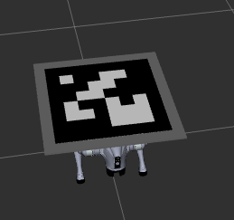
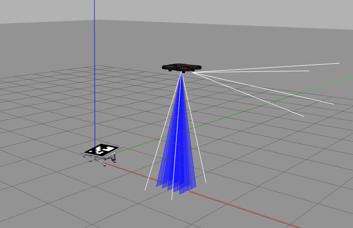
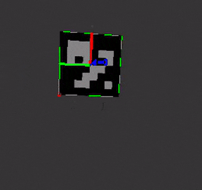
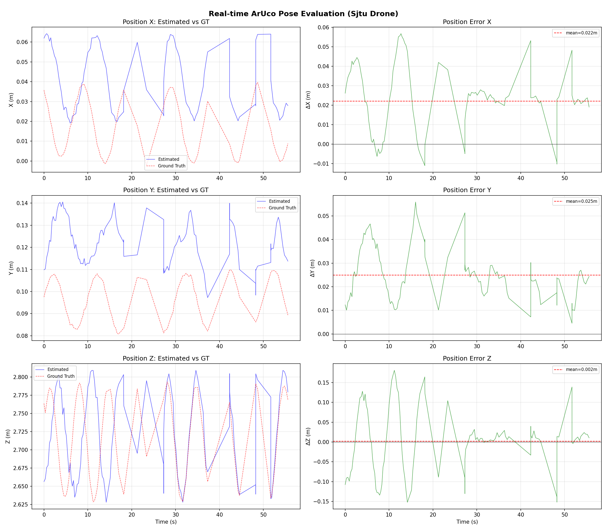
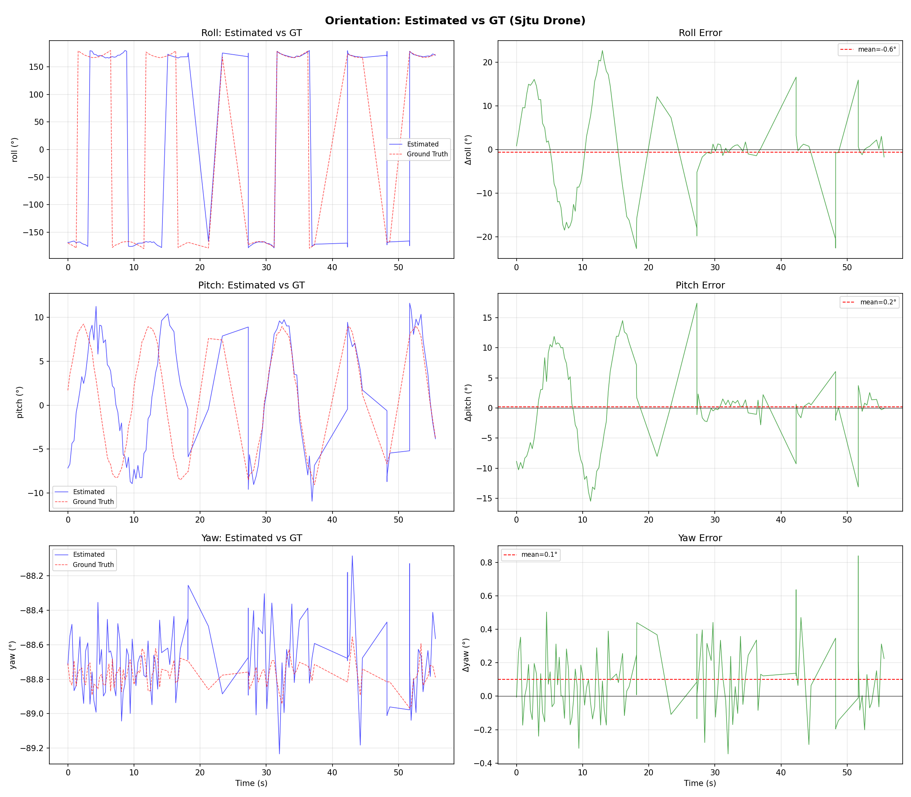
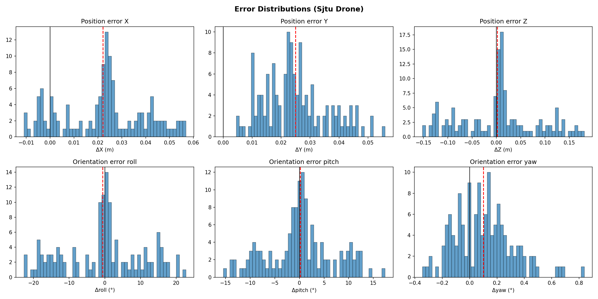
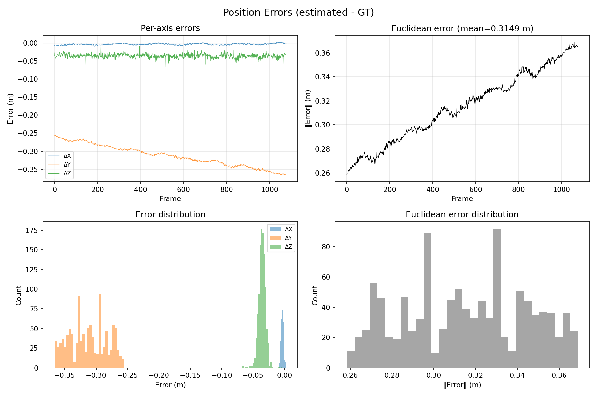
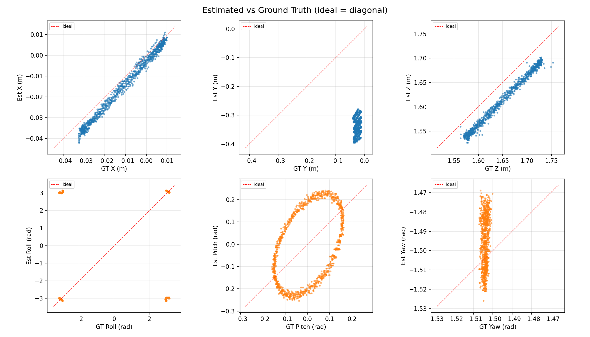
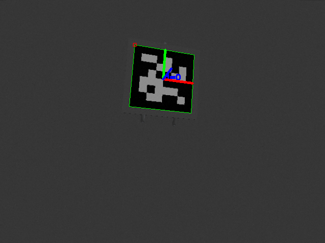

# go2-marine-platform

> Framework de simulación de plataforma marina para el desarrollo y validación de algoritmos de estimación de pose visual en entornos marinos.

  

Un robot cuadrúpedo Unitree Go2 simula el movimiento de una plataforma marina (roll, pitch, heave) mientras una cámara fija o un dron detectan en tiempo real un marcador ArUco colocado sobre la plataforma. El pipeline completo — simulación → detección → grabación → evaluación offline contra ground truth — permite desarrollar y validar algoritmos de estimación de pose sin riesgo de hardware.

<table>
  <tr>
    <td align="center"><b>Plataforma marina con marcador ArUco</b></td>
    <td align="center"><b>Dron SJTU hovering sobre la plataforma</b></td>
  </tr>
  <tr>
    <td align="center"></td>
    <td align="center"></td>
  </tr>
</table>

<p align="center">
  <br>
  <em>Detección ArUco en tiempo real desde la cámara del dron</em>
</p>

## Descripción

Este proyecto implementa un entorno de simulación que combina:
- Robot cuadrúpedo Unitree Go2 operando como si fuese una plataforma marina simulada
- Movimientos marinos realistas (heave, pitch, roll)
- **Cámara fija** nadir para captura visual sin movimiento
- **Dron sjtu_drone** con vuelo real y cámara bottom para aterrizaje visual
- Marcador ArUco en la plataforma para detección visual
- Sistema de grabación y reproducción de datos

## Motivación

Aterrizar drones de forma autónoma sobre embarcaciones en movimiento es un problema complejo: el oleaje genera movimientos impredecibles de la plataforma y cualquier prueba real implica el riesgo de perder el hardware. Este proyecto provee un **framework de simulación completo** que permite:

- Reproducir condiciones de mar de forma controlada y repetible
- Validar la precisión de la estimación de pose visual (ArUco + `solvePnP`) antes de pasar a hardware real
- Generar datasets con ground truth exacto para benchmarking o entrenamiento
- Comparar estimaciones en tiempo real contra el ground truth del simulador frame a frame

El branch `real` extiende este pipeline a pruebas de laboratorio con hardware real.

## Arquitectura

```
gazebo-no-seas-malo/
├── src/
│   ├── fixed_camera/               # Cámara fija nadir (sin movimiento)
│   │   ├── fixed_camera/
│   │   │   ├── camera_controller.py    # Publica pose fija + TF estático
│   │   │   └── aruco_detector.py       # Detección ArUco en tiempo real
│   │   ├── launch/
│   │   │   └── fixed_camera.launch.py  # Cámara fija (+ ArUco con aruco:=true)
│   │   ├── urdf/
│   │   │   └── fixed_camera.xacro      # Modelo URDF de la cámara
│   │   └── config/
│   │       ├── fixed_camera_params.yaml
│   │       └── aruco_detector_params.yaml
│   ├── sjtu_drone/                 # Dron con vuelo real (sjtu_drone)
│   │   ├── sjtu_drone_description/     # URDF, plugin de Gazebo, worlds
│   │   ├── sjtu_drone_bringup/         # Launch files y configs
│   │   │   ├── launch/
│   │   │   │   └── sjtu_drone_spawn.launch.py
│   │   │   └── config/
│   │   │       ├── drone.yaml
│   │   │       ├── drone_position_params.yaml
│   │   │       └── aruco_detector_params.yaml
│   │   └── sjtu_drone_control/         # Nodos de control
│   │       └── sjtu_drone_control/
│   │           ├── drone_position_controller.py
│   │           ├── aruco_detector.py
│   │           └── teleop.py
│   ├── go2_tools/                  # Simulador de plataforma marina
│   └── unitree-go2-ros2/           # Paquetes del robot Unitree Go2
│                                   # https://github.com/maxgubitosi/unitree-go2-ros2
├── aruco_relative_pose/            # Estimación de pose offline y evaluación
│   ├── scripts/
│   │   ├── estimate_relative_pose.py       # Estimación offline desde dataset
│   │   ├── analyze_pose_results.py         # Análisis y gráficos
│   │   └── evaluate_realtime_aruco.py      # Evaluación offline vs GT desde rosbag
│   └── config.yaml
├── marine_robot_dataset/           # Extracción de datasets desde rosbags
├── rosbags/                        # Grabaciones y scripts de reproducción
└── README.md
```

## Pipeline

```
 Gazebo + Go2 (fijo)
       │
       ▼
 marine_platform_simulator  ──── publica Pose (roll/pitch/heave) ──▶ /body_pose
       │
       ▼
 Fuente de imagen
  ├─ Cámara fija nadir (z = 2 m)   →  /fixed_camera/image_raw
  └─ SJTU Drone (hover z = 3 m)    →  /drone/bottom/image_raw
       │
       ▼
 aruco_detector (solvePnP)
       │  /aruco/pose  /aruco/debug_image
       ▼
 rosbag recording
       │
       ▼
 evaluate_realtime_aruco.py
  └─ estimación vs ground truth (odom + IMU + heave + pose del dron)
       │
       ▼
 analyze_pose_results.py  →  gráficos + CSV de error
```

1. **Gazebo + Go2** — el robot está fijo al suelo; sus articulaciones mueven el torso simulando oleaje marino.
2. **marine_platform_simulator** — genera ondas sinusoidales o irregulares y publica `Pose` a `/body_pose` @ 20 Hz.
3. **Fuente de imagen** — cámara fija nadir a 2 m (cámara sintética estática en Gazebo) o dron SJTU que despega automáticamente y hovea a 3 m.
4. **aruco_detector** — detecta el marcador ArUco DICT_6X6_250 (id=0, 0.50 m) y estima la pose relativa con `solvePnP` en tiempo real.
5. **Evaluación offline** — compara cada estimación con el ground truth calculado desde odometría + IMU + heave del simulador.

## Requisitos

- ROS2 Humble (Desktop)
- Gazebo Classic
- Python 3.10+

**Paquetes de sistema (apt):**
```bash
sudo apt install \
  ros-humble-gazebo-ros-pkgs ros-humble-gazebo-ros2-control \
  ros-humble-robot-state-publisher ros-humble-joint-state-publisher \
  ros-humble-xacro ros-humble-cv-bridge ros-humble-tf2-ros \
  ros-humble-robot-localization ros-humble-ros2-controllers ros-humble-ros2-control \
  ros-humble-velodyne ros-humble-imu-tools ros-humble-teleop-twist-keyboard \
  python3-opencv xterm
```

**Python (pip) — evaluación offline:**
```bash
pip install opencv-contrib-python numpy pandas PyYAML
```

## Instalación

```bash
# 1. Clonar el repositorio
git clone https://github.com/maxgubitosi/gazebo-no-seas-malo.git
cd gazebo-no-seas-malo

# 2. Clonar unitree-go2-ros2 dentro de src/
#    (contiene: CHAMP controller, go2_config, go2_description y launch files del Go2)
cd src
git clone https://github.com/maxgubitosi/unitree-go2-ros2
cd ..

# 3. Compilar el workspace
colcon build --symlink-install
source install/setup.bash
```

> **Nota:** `unitree-go2-ros2` es un fork de [anujjain-dev/unitree-go2-ros2](https://github.com/anujjain-dev/unitree-go2-ros2) con adaptaciones para la plataforma marina. Debe clonarse manualmente dentro de `src/` antes de compilar.

## Uso básico

### Opción 1: Script automático

```bash
./run_marine_simulation.sh
```

### Opción 2: Cámara fija (sin movimiento)

Spawnea una cámara estática mirando hacia abajo sobre la plataforma. No se mueve en ningún sentido — lo que se ve en Gazebo es exactamente lo que dicen los datos.

```bash
# Terminal 1: Gazebo y RViz
colcon build --symlink-install
source install/setup.bash
ros2 launch go2_config gazebo.launch.py rviz:=true

# Terminal 2: Simulador de plataforma marina
source install/setup.bash
ros2 run go2_tools marine_platform_simulator

# Terminal 3: Cámara fija (sin ArUco)
source install/setup.bash
ros2 launch fixed_camera fixed_camera.launch.py aruco:=false

# Terminal 4 (opcional): Grabar datos
cd rosbags
./record_marine_simulation.sh 60
```

### Opción 3: Cámara fija + detección ArUco

Lanza la cámara fija con el nodo de detección ArUco incluido. Estima la pose del marcador (DICT_6X6_250 id=0, 0.50m) relativa a la cámara en tiempo real usando `cv2.aruco` + `solvePnP`.

```bash
# Terminal 1: Gazebo y RViz
colcon build --symlink-install
source install/setup.bash
ros2 launch go2_config gazebo.launch.py rviz:=true

# Terminal 2: Simulador de plataforma marina
source install/setup.bash
ros2 run go2_tools marine_platform_simulator

# Terminal 3: Cámara fija + detector ArUco
source install/setup.bash
ros2 launch fixed_camera fixed_camera.launch.py

# Terminal 4: Visualizar detección en tiempo real
source /opt/ros/humble/setup.bash
ros2 run rqt_image_view rqt_image_view
# Seleccionar el topic /aruco/debug_image en el dropdown

# Terminal 5 (opcional): Ver pose estimada
source install/setup.bash
ros2 topic echo /aruco/pose

# Terminal 6 (opcional): Grabar datos para evaluación offline
cd rosbags
./record_marine_simulation.sh 60
```

### Opción 4: Dron sjtu_drone (vuelo real + ArUco)

Spawnea un dron sjtu_drone que despega automáticamente, vuela sobre la plataforma y detecta el ArUco desde la cámara bottom.

```bash
# Terminal 1: Gazebo y RViz
colcon build --symlink-install
source install/setup.bash
ros2 launch go2_config gazebo.launch.py rviz:=true

# Terminal 2: Simulador de plataforma marina
source install/setup.bash
ros2 run go2_tools marine_platform_simulator

# Terminal 3: sjtu_drone (spawn + takeoff + hover + ArUco)
source install/setup.bash
ros2 launch sjtu_drone_bringup sjtu_drone_spawn.launch.py

# Terminal 4: Visualizar detección en tiempo real
source /opt/ros/humble/setup.bash
ros2 run rqt_image_view rqt_image_view
# Seleccionar el topic /aruco/debug_image en el dropdown

# Terminal 5 (opcional): Grabar datos
cd rosbags
./record_sjtu_drone_simulation.sh 60
```

#### Evaluación offline (post-proceso)

Una vez grabado el rosbag, se puede comparar la estimación en tiempo real con el ground truth del Go2 (odometría + IMU + heave). El script calcula las transformaciones necesarias para llevar el GT al frame de la cámara y lo compara con las estimaciones del detector:

```bash
python3 aruco_relative_pose/scripts/evaluate_realtime_aruco.py rosbags/<nombre_rosbag>
```

Genera un CSV con errores por frame y gráficos de posición/orientación estimada vs GT en `aruco_relative_pose/outputs/`.

## Componentes principales

### Unitree Go2 ROS2

Paquetes base del robot cuadrúpedo Unitree Go2 para ROS2. Incluye descripción URDF, controladores, configuración de Gazebo y navegación autónoma.

**Instalación:**
```bash
cd ~/gazebo-no-seas-malo/src
git clone https://github.com/maxgubitosi/unitree-go2-ros2
```

Este repositorio contiene:
- `champ` - Framework base para robots cuadrúpedos
- `go2_config` - Configuración específica del Unitree Go2
- `go2_description` - Descripción URDF y meshes del robot
- Launch files para Gazebo, RViz, SLAM y navegación

Ver el [repositorio](https://github.com/maxgubitosi/unitree-go2-ros2) para más detalles.

### Fixed Camera
Cámara fija nadir (mirando hacia abajo) para captura visual sobre la plataforma marina. No se mueve — posición estática configurable. Ver `src/fixed_camera/README.md` para más detalles.

### sjtu_drone
Dron cuadricóptero con vuelo real simulado en Gazebo (plugin C++). Despega automáticamente, vuela sobre la plataforma y detecta ArUco desde cámara bottom. Ver `src/sjtu_drone/` para más detalles.

### Go2 Tools
Herramientas para simulación de movimientos marinos en el robot Unitree Go2. Incluye generación automática de ondas y control manual. Ver `src/go2_tools/README.md` para más detalles.

### Rosbags
Sistema de grabación y reproducción de simulaciones. Ver `rosbags/` para scripts y ejemplos.

## Nodos ROS2

| Nodo | Paquete | Entrada | Salida | Descripción |
|------|---------|---------|--------|-------------|
| `marine_platform_simulator` | `go2_tools` | parámetros de onda | `/body_pose` | Genera oleaje sinusoidal/irregular (roll, pitch, heave) @ 20 Hz |
| `marine_manual_control` | `go2_tools` | teclado | `/marine_platform/manual_cmd` | Control manual de roll/pitch/heave desde teclado |
| `camera_controller` | `fixed_camera` | — | `/fixed_camera/pose`, TF `world→camera` | Publica pose fija y TF estático de la cámara nadir |
| `aruco_detector` | `fixed_camera` | `/fixed_camera/image_raw` | `/aruco/pose`, `/aruco/debug_image` | Detecta ArUco DICT_6X6_250 (id=0, 0.50 m) con `solvePnP` |
| `drone_position_controller` | `sjtu_drone_control` | `/drone/gt_pose` | `/drone/cmd_vel` | Auto-takeoff → hover a z = 3.0 m sobre la plataforma |
| `aruco_detector` | `sjtu_drone_control` | `/drone/bottom/image_raw` | `/aruco/pose`, `/aruco/debug_image` | Mismo pipeline ArUco desde cámara bottom del dron |

## Topics principales

### Cámara fija
- `/fixed_camera/image_raw` - Imagen de cámara fija (640x480 @ 30Hz)
- `/fixed_camera/camera_info` - Parámetros intrínsecos de cámara
- `/fixed_camera/pose` - Pose fija de la cámara en el mundo

### sjtu_drone
- `/drone/bottom/image_raw` - Imagen de cámara bottom del dron
- `/drone/bottom/camera_info` - Parámetros intrínsecos de cámara bottom
- `/drone/gt_pose` - Ground truth pose del dron desde Gazebo
- `/drone/pose` - Pose del dron (PoseStamped)
- `/drone/state` - Estado del dron (0=LANDED, 1=FLYING, 2=TAKINGOFF, 3=LANDING)

### Comunes
- `/go2/pose_rphz_cmd` - Comandos de movimiento marino [roll, pitch, heave]
- `/aruco/pose` - Pose estimada del marcador ArUco en frame cámara (PoseStamped)
- `/aruco/detection` - Flag de detección del ArUco (Bool)
- `/aruco/debug_image` - Imagen anotada con bordes y ejes del ArUco detectado

## Resultados

Resultados sobre sesiones grabadas con el dron SJTU hovering a ~3 m sobre la plataforma Go2 con oleaje activo:

| Métrica | Valor |
|---------|-------|
| Error euclidiano medio | ~7 cm (a 2.7 m de distancia) |
| Error relativo | ~2.5% de la distancia cámara–marcador |
| Eje con mayor varianza | Z (profundidad), std 5–8 cm |
| Orientación más precisa | Yaw < 0.2° de error |
| Tasa de detección | 2.4–3.6 Hz |

### Detección en tiempo real — dron SJTU

| Posición estimada vs GT | Orientación estimada vs GT |
|:---:|:---:|
|  |  |



### Análisis offline — cámara fija

| Error de posición | Scatter estimado vs GT |
|:---:|:---:|
|  |  |

### Frame de detección ArUco



*Marcador ArUco DICT_6X6_250 (id=0, lado=0.50 m) sobre el torso del Go2. Ejes de pose estimada superpuestos en tiempo real.*

## Desarrollo

```bash
# Compilar un paquete específico
colcon build --packages-select fixed_camera
colcon build --packages-select go2_tools
colcon build --packages-select sjtu_drone_bringup sjtu_drone_control sjtu_drone_description

# Limpiar build completo
rm -rf build install log
colcon build --symlink-install
```

## Autores

Maximo Gubitosi - mgubitosi@udesa.edu.ar  
Jack Spolski - jspolski@udesa.edu.ar

---

## Roadmap

- [ ] Pruebas de laboratorio con hardware real (branch `real`)
- [ ] Control de aterrizaje autónomo basado en la estimación de pose ArUco
- [ ] Soporte para espectro de oleaje irregular (Pierson-Moskowitz)
- [ ] Integración con modelos de visión más robustos ante condiciones adversas


